# System Architecture Diagrams
## Healthcare Interpreter Booking System with FHIR Integration

---

## 1. High-Level System Architecture

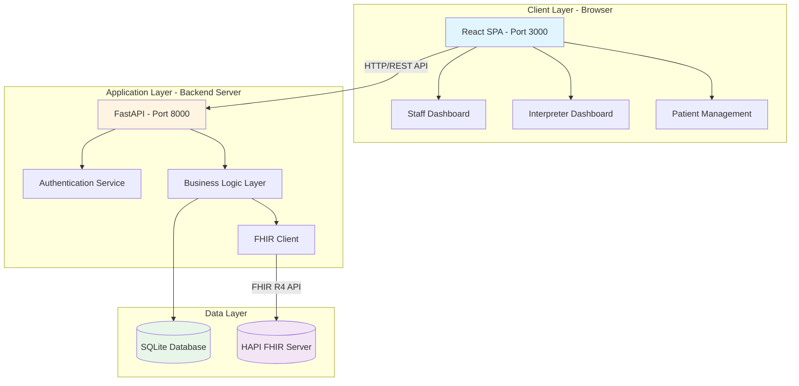

---

## 2. Detailed Component Architecture

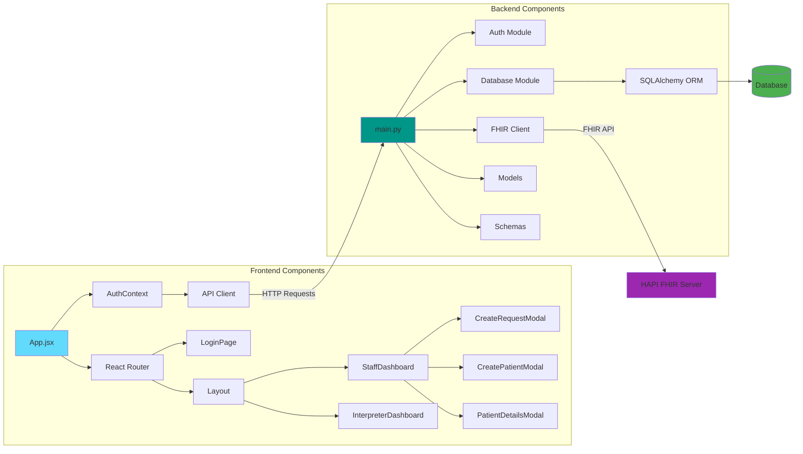

---

## 3. Data Flow Architecture

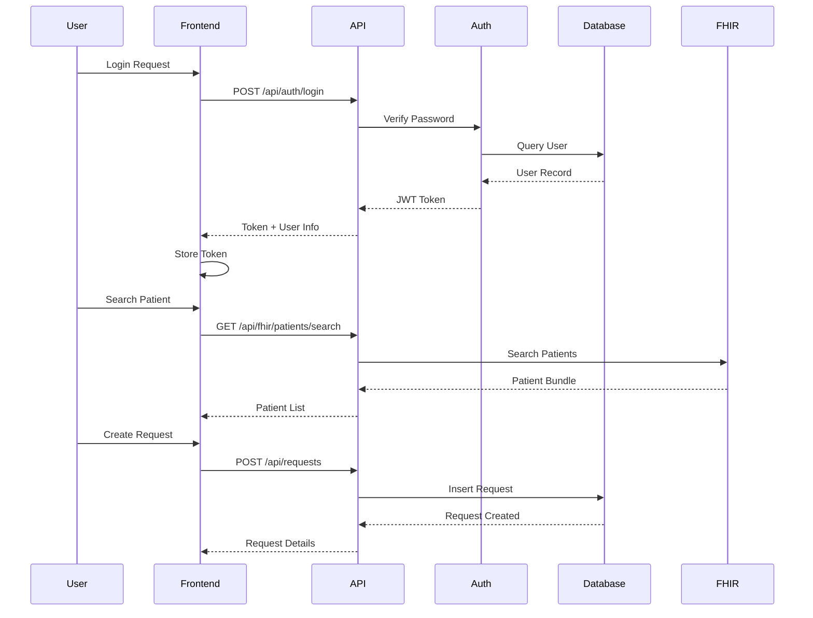

---

## 4. Database Schema (Entity Relationship Diagram)

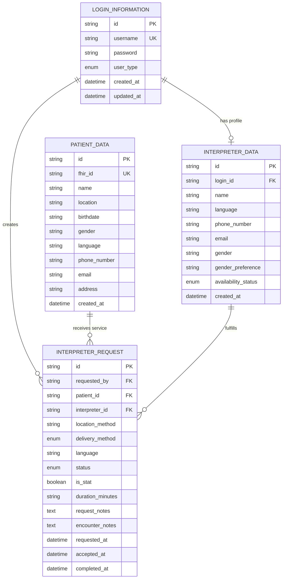

---

## 5. Authentication Flow Diagram

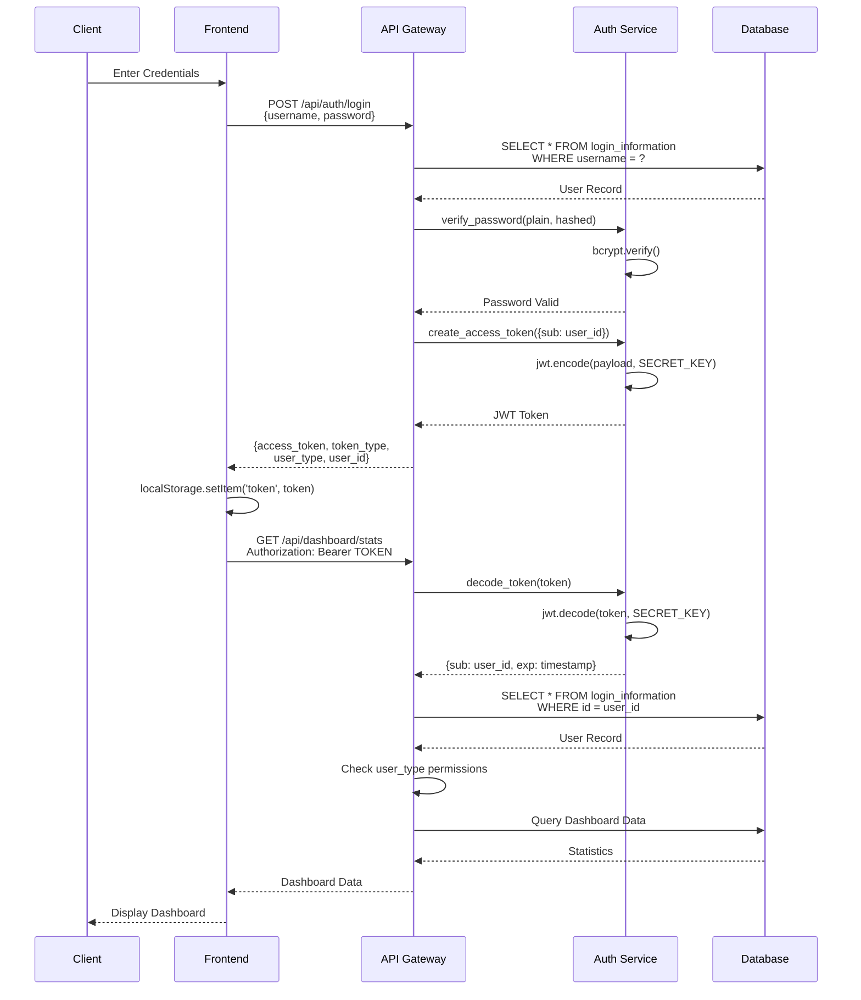

---

## 6. Request Lifecycle State Machine

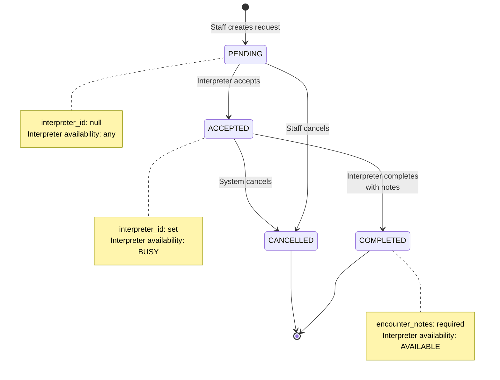

---

## 7. FHIR Integration Architecture

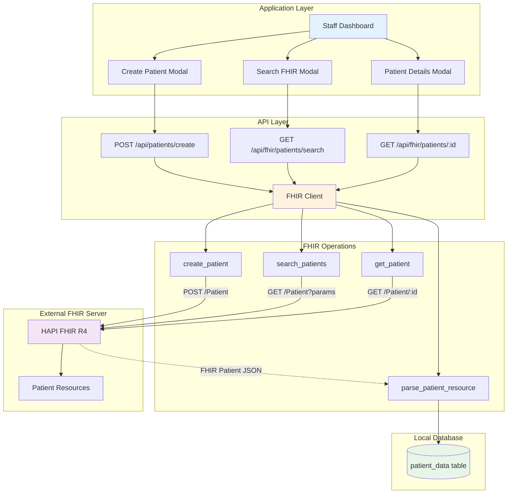

---

## 8. Backend API Architecture

```mermaid
graph LR
    subgraph "API Endpoints"
        A[/api/auth/*]
        B[/api/fhir/patients/*]
        C[/api/patients/*]
        D[/api/interpreters/*]
        E[/api/requests/*]
        F[/api/interpreter/requests/*]
        G[/api/dashboard/*]
    end

    subgraph "Middleware Layer"
        H[CORS Middleware]
        I[Authentication<br/>HTTPBearer]
    end

    subgraph "Authorization Layer"
        J[get_current_user]
        K[require_staff]
        L[require_interpreter]
        M[require_admin]
    end

    subgraph "Business Logic"
        N[Request Management]
        O[Interpreter Matching]
        P[Availability Tracking]
        Q[FHIR Sync Logic]
    end

    subgraph "Data Access"
        R[SQLAlchemy ORM]
        S[FHIR Client]
    end

    A --> H
    B --> H
    C --> H
    H --> I
    I --> J
    J --> K
    J --> L
    J --> M
    K --> N
    L --> O
    N --> R
    O --> R
    Q --> S

    style A fill:#ffebee
    style H fill:#e8f5e9
    style N fill:#e3f2fd
    style R fill:#fff9c4
```

---

## 9. Frontend State Management Architecture

```mermaid
graph TB
    subgraph "Global State - Context API"
        A[AuthContext Provider]
        A --> B[user: LoginInformation]
        A --> C[loading: boolean]
        A --> D[login function]
        A --> E[logout function]
    end

    subgraph "Page-Level State - useState"
        F[StaffDashboard]
        F --> G[stats: DashboardStats]
        F --> H[requests: Array]
        F --> I[loading: boolean]
        F --> J[showModal: boolean]

        K[InterpreterDashboard]
        K --> L[profile: InterpreterData]
        K --> M[pendingRequests: Array]
        K --> N[myRequests: Array]
        K --> O[notes: string]
    end

    subgraph "Component State - useState"
        P[CreateRequestModal]
        P --> Q[step: 1 | 2]
        P --> R[selectedPatient: Patient]
        P --> S[formData: RequestCreate]

        T[PatientDetailsModal]
        T --> U[fhirDetails: FHIRPatient]
        T --> V[loading: boolean]
    end

    subgraph "API Communication Layer"
        W[API Client Singleton]
        W --> X[token: string]
        W --> Y[request method]
    end

    A --> F
    A --> K
    F --> P
    F --> T
    W --> A
    W --> F
    W --> K

    style A fill:#4caf50
    style F fill:#2196f3
    style P fill:#ff9800
    style W fill:#9c27b0
```

---

## 10. Deployment Architecture (Production)

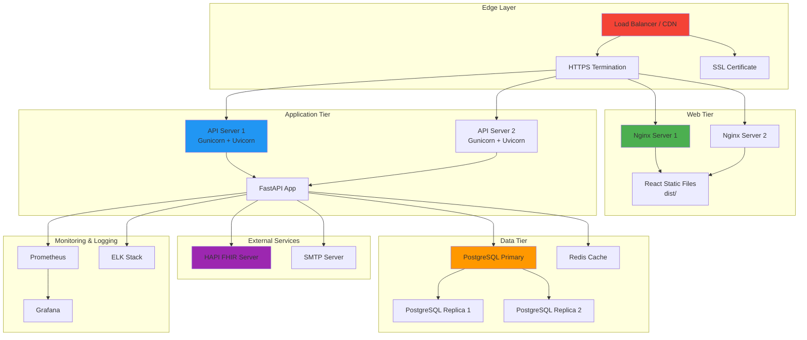

---

## 11. Security Architecture Layers

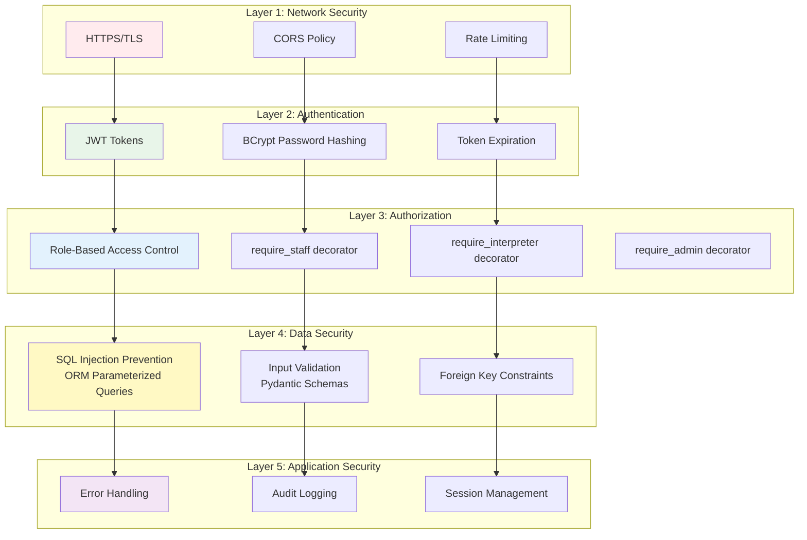

---

## 12. FHIR Patient Sync Flow

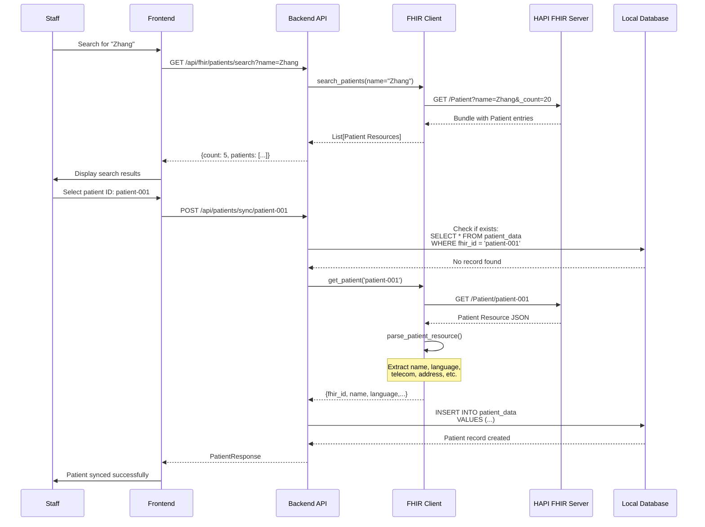

---

## 13. Interpreter Request Workflow

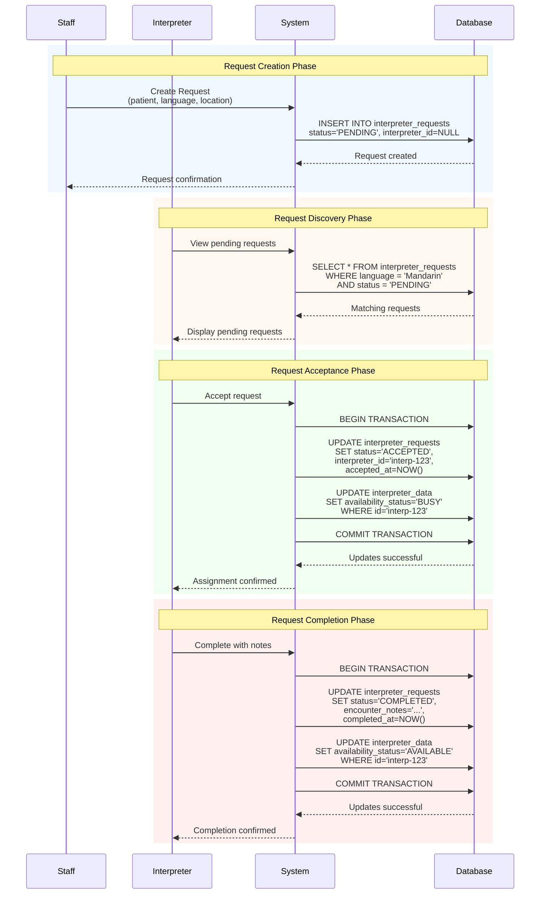

---

## 14. Technology Stack Layers

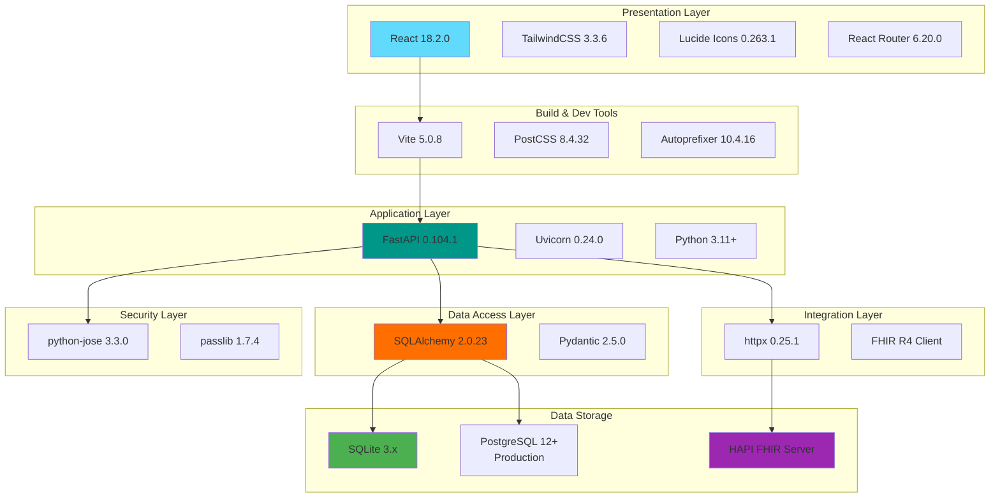

---

## ASCII Diagrams for Documentation

### System Overview (ASCII)

```
┌─────────────────────────────────────────────────────────────────┐
│                    HEALTHCARE INTERPRETER SYSTEM                 │
└─────────────────────────────────────────────────────────────────┘

┌───────────────────────────────────────────────────────────────────┐
│                         CLIENT LAYER                              │
│  ┌──────────────────────────────────────────────────────────┐     │
│  │  React SPA (Vite Dev Server - Port 3000)                 │     │
│  │  ┌──────────────┐  ┌──────────────┐  ┌──────────────┐   │     │
│  │  │    Staff     │  │ Interpreter  │  │   Patient    │   │     │
│  │  │  Dashboard   │  │  Dashboard   │  │ Management   │   │     │
│  │  └──────────────┘  └──────────────┘  └──────────────┘   │     │
│  └──────────────────────────────────────────────────────────┘     │
└───────────────────────────┬───────────────────────────────────────┘
                            │ HTTP REST API (JSON)
                            │ Authorization: Bearer JWT
                            ↓
┌───────────────────────────────────────────────────────────────────┐
│                      APPLICATION LAYER                            │
│  ┌──────────────────────────────────────────────────────────┐     │
│  │  FastAPI Backend (Uvicorn - Port 8000)                   │     │
│  │  ┌──────────┐  ┌──────────┐  ┌──────────┐  ┌─────────┐  │     │
│  │  │   Auth   │  │ Business │  │   FHIR   │  │  CORS   │  │     │
│  │  │  Service │  │  Logic   │  │  Client  │  │Middleware│ │     │
│  │  └──────────┘  └──────────┘  └──────────┘  └─────────┘  │     │
│  └──────────────────────────────────────────────────────────┘     │
└──────────────────┬──────────────────────────────┬─────────────────┘
                   │                              │
                   ↓                              ↓
┌────────────────────────────────┐   ┌───────────────────────────┐
│       DATA LAYER               │   │   EXTERNAL FHIR LAYER     │
│  ┌──────────────────────────┐  │   │  ┌────────────────────┐   │
│  │   SQLite Database        │  │   │  │  HAPI FHIR Server  │   │
│  │                          │  │   │  │  (R4 Specification)│   │
│  │  • login_information     │  │   │  │                    │   │
│  │  • patient_data          │  │   │  │  • Patient         │   │
│  │  • interpreter_data      │  │   │  │  • Appointment     │   │
│  │  • interpreter_requests  │  │   │  │  • Encounter       │   │
│  └──────────────────────────┘  │   │  └────────────────────┘   │
└────────────────────────────────┘   └───────────────────────────┘
```

### Database Schema (ASCII ERD)

```
┌─────────────────────────┐
│  LOGIN_INFORMATION      │
├─────────────────────────┤
│ PK id: VARCHAR          │
│ UK username: VARCHAR    │
│    password: VARCHAR    │◄─────┐
│    user_type: ENUM      │      │
│    created_at: DATETIME │      │ 1:1
│    updated_at: DATETIME │      │
└─────────────────────────┘      │
         │                       │
         │ 1:N                   │
         │                       │
         ↓                       │
┌─────────────────────────┐      │
│ INTERPRETER_REQUEST     │      │
├─────────────────────────┤      │
│ PK id: VARCHAR          │      │
│ FK requested_by: VARCHAR│      │
│ FK patient_id: VARCHAR  ├──┐   │
│ FK interpreter_id: VAR* │  │   │
│    location_method: VAR │  │   │
│    delivery_method: ENUM│  │   │
│    language: VARCHAR    │  │   │
│    status: ENUM         │  │   │
│    is_stat: BOOLEAN     │  │   │
│    requested_at: DTTIME │  │   │
│    accepted_at: DTTIME  │  │   │
│    completed_at: DTTIME │  │   │
└─────────────────────────┘  │   │
         ↑                   │   │
         │ N:1               │   │
         │                   │   │
┌─────────────────────────┐  │   │
│  INTERPRETER_DATA       │  │   │
├─────────────────────────┤  │   │
│ PK id: VARCHAR          │  │   │
│ FK login_id: VARCHAR    ├──┘   │
│    name: VARCHAR        │      │
│    language: VARCHAR    │      │
│    availability: ENUM   │      │
│    phone_number: VARCHAR│      │
│    email: VARCHAR       │      │
│    gender: VARCHAR      │      │
└─────────────────────────┘      │
                                 │
         ┌───────────────────────┘
         │ N:1
         ↓
┌─────────────────────────┐
│     PATIENT_DATA        │
├─────────────────────────┤
│ PK id: VARCHAR          │
│ UK fhir_id: VARCHAR     │
│    name: VARCHAR        │
│    language: VARCHAR    │
│    location: VARCHAR    │
│    birthdate: VARCHAR   │
│    gender: VARCHAR      │
│    address: VARCHAR     │
│    phone_number: VARCHAR│
│    email: VARCHAR       │
│    created_at: DATETIME │
└─────────────────────────┘
```

---

## How to Use These Diagrams

1. **Mermaid Diagrams**: Can be rendered in:
   - GitHub markdown files
   - GitLab
   - VS Code with Mermaid extension
   - Online viewers: https://mermaid.live/

2. **ASCII Diagrams**: Display correctly in:
   - Plain text files
   - Code editors
   - Terminal/console
   - Documentation wikis

3. **Export Options**:
   - Mermaid diagrams can be exported to PNG/SVG
   - Use mermaid-cli: `mmdc -i diagram.mmd -o diagram.png`

---

**Generated:** 2025-11-09
**Version:** 1.0
